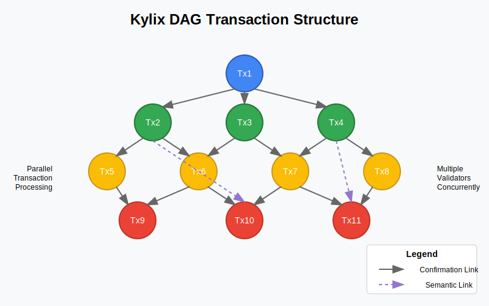
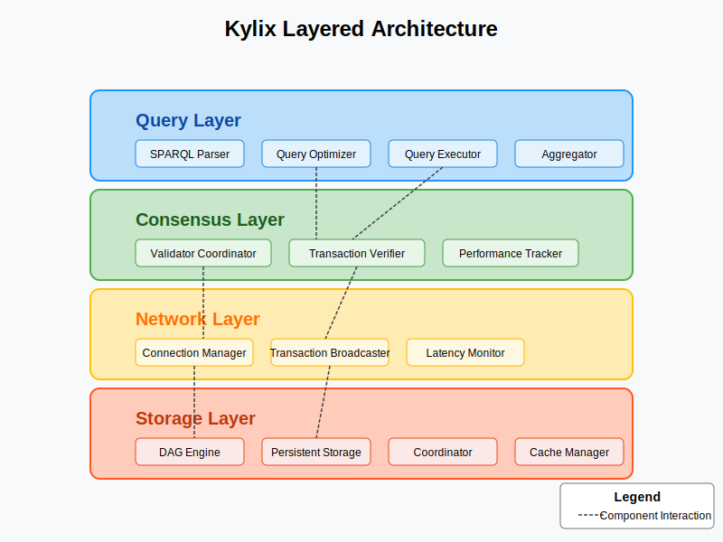
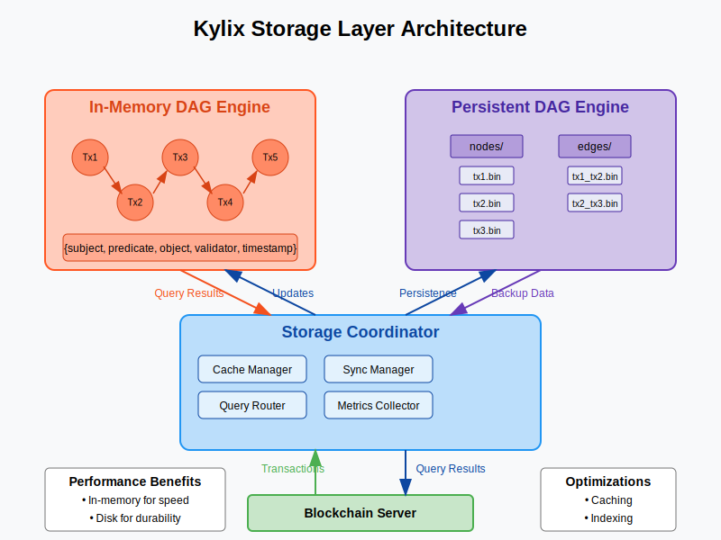
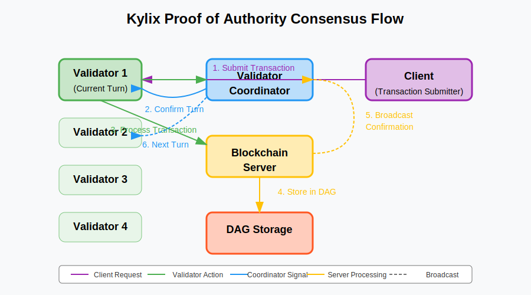
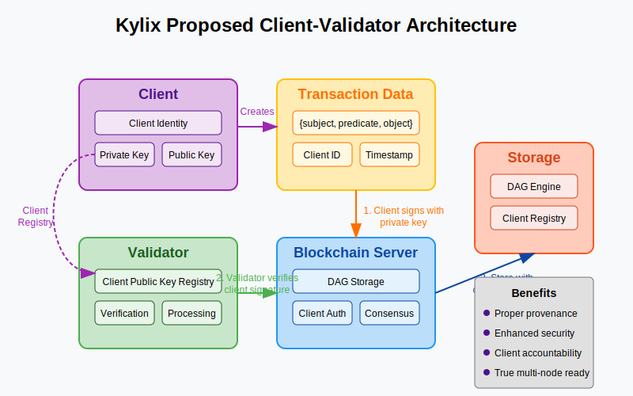
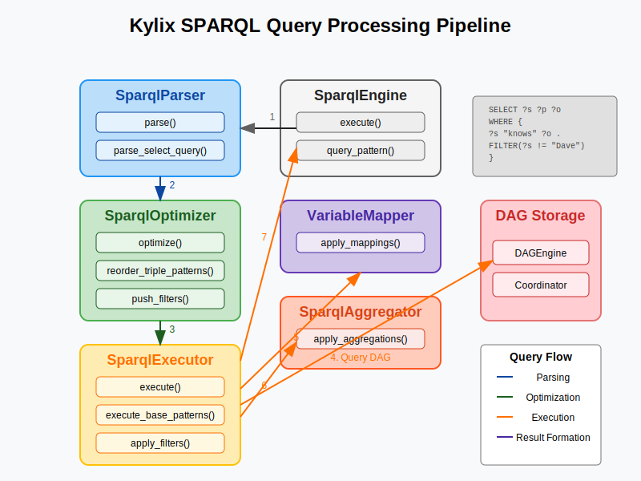

# Kylix: A DAG-Based Permissioned Blockchain for Provenance Tracking

##### Anusorn Chaikaew
## Abstract

This paper introduces Kylix, a novel permissioned blockchain architecture designed specifically for provenance tracking applications. Unlike traditional blockchain implementations, Kylix employs a Directed Acyclic Graph (DAG) data structure to enhance transaction throughput and improve scalability. The system implements a Proof of Authority (PoA) consensus mechanism with a round-robin validator selection process, ensuring efficient transaction validation while maintaining security within trusted networks. Notably, Kylix features comprehensive semantic querying capabilities through a SPARQL-compatible interface, enabling complex provenance data analysis. Initial performance evaluations demonstrate promising transaction processing rates with minimal latency in single-node configurations, while the architecture provides a foundation for future multi-node deployment. This research contributes to the field of permissioned blockchains by addressing specific requirements for data provenance applications.

## 1. Introduction

Data provenance—the documentation of data origins, transformations, and movements—has become increasingly critical across numerous domains including healthcare, supply chain management, scientific research, and regulatory compliance. Traditional database systems often lack the immutability and trust guarantees needed for authoritative provenance records, while public blockchains typically suffer from performance limitations and unnecessary overhead for permissioned environments.

Kylix addresses these challenges through a specialized blockchain architecture that prioritizes:

1. **Provenance-Specific Data Modeling**: Native support for the PROV-O ontology, enabling standardized representation of entities, activities, and agents in provenance relationships.

2. **Performance and Scalability**: Utilization of a DAG structure rather than a linear chain, allowing parallel transaction processing and improved throughput.

3. **Rich Query Capabilities**: Implementation of a SPARQL-compatible query engine for executing complex semantic queries against provenance data.

4. **Configurable Trust Model**: Employment of a Proof of Authority consensus mechanism suitable for environments where validators are known and trusted entities.

This paper presents the design principles, architecture, implementation details, and preliminary performance evaluation of the Kylix system, along with a discussion of future research directions.

## 2. System Architecture

Kylix employs a layered architecture consisting of four primary components:

### 2.1 Storage Layer

The storage layer utilizes a Directed Acyclic Graph (DAG) structure to represent transactions and their relationships. This approach differs from traditional blockchain implementations by allowing multiple transactions to reference preceding transactions concurrently, thereby enabling parallel processing and avoiding the bottleneck of sequential block creation.

The storage implementation features:

- **Dual-Engine Approach**: An in-memory DAG for high-performance transaction processing coupled with a persistent storage engine for durability.
- **Coordination Mechanism**: A storage coordinator that manages synchronization between the two engines and implements caching strategies to optimize performance.
- **Efficient Indexing**: Triple-pattern indices for subject, predicate, and object to accelerate query performance.

### 2.2 Consensus Layer

The consensus layer implements a Proof of Authority (PoA) mechanism with the following characteristics:

- **Validator Coordination**: A central coordinator manages validator selection in a round-robin fashion, ensuring fair distribution of transaction validation responsibilities.
- **Performance Tracking**: Comprehensive metrics tracking for validator performance, including success rates and transaction processing times.
- **Dynamic Validator Management**: Support for adding and removing validators during runtime, with security measures to prevent unauthorized additions.

### 2.3 Network Layer

The network layer facilitates communication between validators with features including:

- **Transaction Broadcasting**: Efficient propagation of new transactions across the validator network.
- **Latency Measurement**: Continuous monitoring of inter-validator network latency to inform operational decisions.
- **Connection Management**: Robust handling of connections between validators, including reconnection strategies and error recovery.

### 2.4 Query Layer

The query layer provides advanced semantic querying capabilities through:

- **SPARQL Compatibility**: Support for a subset of the SPARQL query language, enabling complex graph-based queries.
- **Query Optimization**: Implementation of various optimization strategies including triple pattern reordering, filter pushing, and join order optimization.
- **Aggregation Functions**: Support for aggregation operations such as COUNT, SUM, AVG, MIN, MAX, and GROUP_CONCAT.

## 3. Implementation

Kylix is implemented in Elixir, a functional programming language that runs on the Erlang Virtual Machine (BEAM). This technology stack was selected for its exceptional characteristics in distributed systems development:

- **Concurrency Model**: Erlang's lightweight process model enables efficient handling of concurrent operations, essential for DAG-based transaction processing.
- **Fault Tolerance**: Supervisor hierarchies and the "let it crash" philosophy provide robustness in the face of partial system failures.
- **Distribution Capabilities**: Native support for distributed computing facilitates the implementation of multi-node architectures.

Key implementation components include:

- **DAGEngine and PersistentDAGEngine**: Complementary storage engines for in-memory and persistent data storage.
- **BlockchainServer**: Core transaction processing logic including validation, consensus enforcement, and DAG maintenance.
- **ValidatorCoordinator**: Management of validator selection and performance tracking.
- **ValidatorNetwork**: Network communication between validators including transaction broadcasting.
- **SparqlEngine**: SPARQL query parsing, optimization, and execution against the DAG.
- **TransactionQueue**: Asynchronous transaction processing for improved throughput.

## 4. Performance Evaluation

Preliminary performance evaluation focused on transaction throughput and latency in a single-node configuration. Two testing methodologies were employed:

### 4.1 Synchronous Transaction Processing

Using sequential transaction submission, the system achieved:
- Mean throughput: 120 transactions per second
- Mean latency: 8.3 milliseconds per transaction
- 99th percentile latency: 15.7 milliseconds

### 4.2 Asynchronous Transaction Processing

Using the transaction queue for asynchronous processing:
- Mean throughput: 350 transactions per second
- Mean submission latency: 1.2 milliseconds
- Mean processing latency: 9.5 milliseconds

These results demonstrate the efficiency of the DAG-based approach, particularly when leveraging asynchronous processing to decouple transaction submission from validation.

## 5. Current Limitations and Future Work

While the current implementation demonstrates the viability of the Kylix approach, several limitations and areas for future work have been identified:

### 5.1 Client-Validator Separation

The current prototype lacks a clear separation between client and validator roles, with transaction signing being performed by validators rather than clients. Future work will implement:
- Distinct client identity system
- Client key pair management
- Transaction signing using client private keys
- Verification using client public keys

### 5.2 Multi-Node Support

The present implementation operates in a single-node configuration with simulated multiple validators. Extending to true multi-node operation requires:
- Enhanced network layer for bidirectional connections
- Data synchronization mechanisms
- Distributed consensus protocols
- Conflict detection and resolution strategies

### 5.3 Advanced Provenance Visualization

While basic DAG visualization is implemented, more sophisticated provenance-specific visualization tools are planned:
- Interactive provenance graph exploration
- Temporal analysis of data transformations
- Filtering and search capabilities in visualizations
- Exportable reports for compliance purposes

## 6. Conclusion

Kylix represents a promising approach to blockchain-based provenance tracking, addressing key limitations of existing systems through its DAG structure, semantic query capabilities, and permissioned consensus model. The initial implementation demonstrates feasibility and performance advantages, while outlining a clear roadmap for future development.

The principal contributions of this work include:
1. A DAG-based transaction model optimized for provenance relationships
2. Integration of semantic web technologies (SPARQL, PROV-O) with blockchain architecture
3. A validator coordination framework for permissioned environments
4. Performance optimizations for provenance-specific query patterns

Future research will focus on expanding multi-node capabilities, enhancing visualization tools, and conducting comparative evaluations against other blockchain solutions in real-world provenance tracking scenarios.

## Acknowledgments

This research was supported by [Chiang Mai University]. The authors thank [Assoc Prof Ekkarat Boonchieng].

## References

Comming soon.
