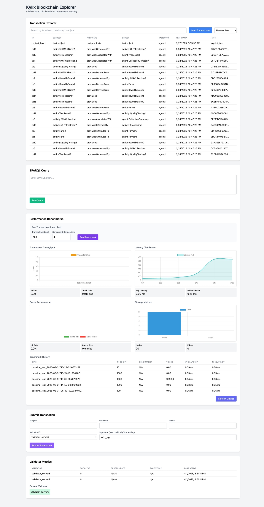

# Kylix Blockchain Project - Comprehensive TODO List

## Completed Tasks ✅

### Core Architecture
- ✅ Implement DAG-based storage structure
- ✅ Create basic Proof of Authority consensus
- ✅ Develop transaction processing pipeline
- ✅ Build SPARQL query engine
- ✅ Implement validator rotation mechanism

### Storage Layer
- ✅ Create in-memory DAG storage engine
- ✅ Implement persistent storage for durability
- ✅ Build storage coordinator with caching
- ✅ Add basic transaction serialization
- ✅ Implement edge management in DAG

### Networking
- ✅ Create basic ValidatorNetwork module
- ✅ Implement basic TCP-based communication
- ✅ Add transaction broadcasting capability
- ✅ Implement network latency measurement
- ✅ Build connection management system

### Query Capabilities
- ✅ Implement basic SPARQL parsing and execution
- ✅ Create query optimization system
- ✅ Develop variable mapping for SPARQL
- ✅ Implement aggregation in queries
- ✅ Add support for complex join operations

### User Interface & Tools
- ✅ Create API server and endpoints
- ✅ Build basic web dashboard
- ✅ Implement transaction queue for async operations
- ✅ Add benchmark and performance tools
- ✅ Create DAG visualization utilities

### Data Traceability
- ✅ Implement basic provenance data model
- ✅ Support PROV-O relationships in transactions
- [ ] Create advanced data lineage visualization
- [ ] Implement interactive provenance graph exploration
- [ ] Develop temporal traceability analysis tools

## Immediate Priorities

### Client-Validator Separation
- [ ] Create distinct Client identity system
- [ ] Implement client key pair management
- [ ] Modify transaction signing to use client private keys
- [ ] Update verification process to use client public keys

### Transaction Flow Refinement
- [ ] Refactor `hash_transaction` to include client identity
- [ ] Update signature verification in `BlockchainServer`
- [ ] Add proper authorization checks for transactions
- [ ] Document the revised transaction flow

### Basic Multi-Node Support Enhancement
- [ ] Improve `ValidatorNetwork` for bidirectional connections
- [ ] Enhance the peer discovery and connection mechanism
- [ ] Add better error handling for network operations
- [ ] Create basic transaction broadcasting tests

## Medium-Term Goals

### Data Traceability Visualization
- [ ] Implement interactive graph visualization for provenance data
- [ ] Create temporal view of data transformations
- [ ] Add filtering and search capabilities to visualizations
- [ ] Develop exportable reports for data lineage

### Data Synchronization
- [ ] Implement `DataSynchronizer` module
- [ ] Create methods for initial (full) sync
- [ ] Develop incremental sync mechanism
- [ ] Add transaction verification during sync

### Consistency and State Management
- [ ] Create checkpointing mechanism for DAG state
- [ ] Implement Merkle tree or similar for state verification
- [ ] Add conflict detection in the DAG
- [ ] Develop simple conflict resolution strategies

### Advanced Consensus Improvements
- [ ] Enhance `ValidatorCoordinator` for distributed operation
- [ ] Implement leader election mechanism
- [ ] Add Byzantine fault tolerance measures
- [ ] Create proper validator scoring system

## Long-Term Development

### Full Multi-Node Architecture
- [ ] Develop distributed configuration management
- [ ] Create network partition handling
- [ ] Implement full state reconciliation
- [ ] Build advanced conflict resolution

### Performance and Scalability
- [ ] Optimize transaction processing
- [ ] Implement sharding or partitioning for the DAG
- [ ] Add advanced caching strategies
- [ ] Create performance benchmarks for multi-node setup

### Security Enhancements
- [ ] Complete security audit of the codebase
- [ ] Implement advanced key rotation mechanisms
- [ ] Add protection against common blockchain attacks
- [ ] Create documentation for security features

## Research and Documentation

### Research Output
- [ ] Finalize architecture diagrams for publication
- [ ] Document consensus mechanism formally
- [ ] Prepare performance comparison with other blockchains
- [ ] Create developer guides for extending the system

## Progress Tracking

- **Completed Tasks:** 27
- **Pending Tasks:** 36
- **Total Tasks:** 63
- **Completion Rate:** 43%

